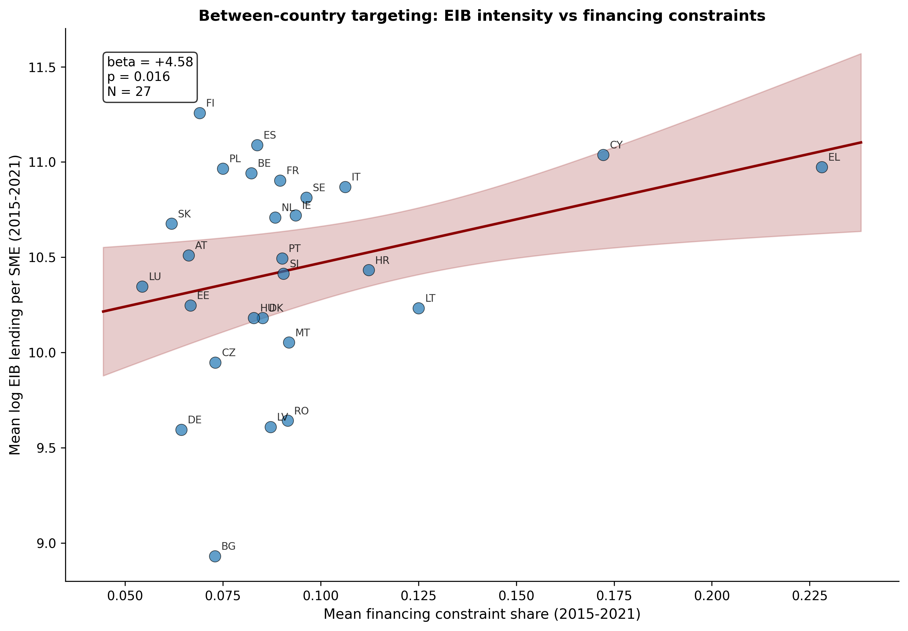

# EIB SME Lending and Financing Constraints: Country-Level Evidence

## Production pipeline

> This research output was produced using the ML research platform for trustworthy human-agent collaboration in regulated environments ([link](https://github.com/ruschenpohler/agent-ml-platform-wp)).

## Abstract

EIB intermediated SME lending is premised on correcting financing market failures. Countries where SMEs face more severe financing obstacles should attract more EIB support, and that support should ease constraints. This project tests these claims empirically using country-level panel data (2015 to 2021) against pre-registered specifications. The primary within-country specification is uninformative: with 27 country clusters, the data cannot rule out moderate counter-cyclical targeting effects in either direction. An exploratory between-country estimator shows that countries with worse average financing constraints do receive more EIB lending per SME on average ($\hat\beta = +6.13$, p $= 0.009$, surviving multiple-hypotheses correction), a cross-sectional pattern that country fixed effects absorb in the within-country specification. Read together, the evidence is consistent with structural targeting across countries but not with counter-cyclical responsiveness within them. A shift-share instrument constructed from sectoral EIB exposure is too weak at the country level (Kleibergen-Paap F $= 2.45$, Borusyak-Hull-Jaravel effective shock count $\approx 6$) to support a causal second stage. With only 27 clusters, the binding constraint is geographic resolution, not choice of specification. The same pipeline, applied to EIB-internal NUTS-2 data or EIBIS microdata, would resolve both limitations, and both extensions are pre-specified with code stubs in place. Our pre-registration is technically novel in that it makes use of a Git commit hash as a cryptographically verifiable timestamp, fixed before data access.

## Data

The panel covers 27 EU member states over 2015 to 2021 (at most 160 country-year observations, with lagged specifications using 133). EIB lending volumes come from the public [EIB Financed Projects](https://www.eib.org/en/projects/loans/index) dataset, which records signed commitments at the country level with no sub-national geographic codes. The constraint measure is the share of SMEs reporting access to finance as their main obstacle to investment, from the ECB Survey on Access to Finance of Enterprises (SAFE), question Q0a. The SME denominator is the count of enterprises with 10 to 249 employees from Eurostat SBS V11110. GDP per capita is from Eurostat `nama_10_pc` at current prices. Fixed effects are at country and year level. A 2020 indicator captures the COVID shock; the prespec also flags 2021 as a robustness check.

## Results

### Note on pre-registration

> **Pre-registered design.** All *primary* specifications below were pre-registered before data access. This excluded robustness checks and simple, illustrative heterogeneity analysis. New, exploratory analyses are labelled accordingly.
> Pre-analysis plan: [`f0313ba8ae0a293c36e2efbb581512e5c69cfbcd`](https://github.com/ruschenpohler/eib-seclending/blob/f0313ba8ae0a293c36e2efbb581512e5c69cfbcd/prespec-plan.md)
> · [Commit timestamp](https://github.com/ruschenpohler/eib-seclending/commit/f0313ba8ae0a293c36e2efbb581512e5c69cfbcd)

### Constraint geography and macro co-movement

With regressions confined to 27 EU member state clusters, the raw patterns in the data are themselves a face-validity check.


*Figure 1: Financing constraint severity by country, 2015 to 2021 mean (ECB SAFE). Constraint shares are highest in Southern and Eastern Europe and lowest in Northern and Western Europe.*

The geographic distribution of financing constraints aligns with common notions of market-failure geography. Cyprus, Greece, Croatia, Bulgaria, Romania, Hungary, and Portugal report the highest shares of SMEs ranking access to finance as their main obstacle. Denmark, Netherlands, Germany, Austria, Luxembourg, Sweden, and Finland report the lowest. The constraint measure is, prima facie, a plausible indicator of financing-gap severity.


*Figure 2: Mean EIB lending intensity and financing constraint share, EU-27 averages 2015 to 2021.*

Mean EIB intensity and mean constraint severity both fell from 2015 to 2018 and partly recovered into 2019. The co-movement is consistent with both series responding to the same macroeconomic environment (falling interest rates and ECB quantitative easing reduced financing constraints while compressing demand for intermediated EIB credit), rather than EIB responding to constraint severity per se. In 2020 both series spiked together, illustrating the role of COVID-19, which the fixed-effects specification absorbs only imperfectly.


*Figure 3: Between-country scatter of mean log EIB lending per SME against mean financing constraint share, 2015 to 2021. Each point is a country labelled by ISO-2 code; the regression line and 95% confidence band are from the between estimator ($\hat\beta = +6.13$, p $= 0.009$).*

The between scatter visualises the cross-sectional targeting relationship. Countries with worse average financing constraints (Southern and Eastern Europe) cluster in the upper right, and low-constraint Northern and Western European countries cluster in the lower left. The fit is driven by the structural geographic gradient rather than by time-varying deviations within countries.

### Does EIB lending target countries with worse financing constraints?

Our primary pre-registered specification asks whether log EIB lending per SME co-varies with constraint severity within country-year cells, controlling for log GDP per capita, country fixed effects, year fixed effects, and a 2020 indicator:

$$\log(E_{rt}) = \beta \cdot C_{rt} + \gamma \cdot \log(G_{rt}) + \delta_r + \theta_t + D_{2020} + \varepsilon_{rt}$$

where $E_{rt}$ is EIB volume per SME, $C_{rt}$ is the constraint share, and $G_{rt}$ is GDP per capita. With at most 160 country-year observations across 27 clusters, cluster-robust standard errors are unreliable; wild cluster bootstrap (WCB: 999 reps, Rademacher weights) is used throughout for within-country specifications. The between estimator collapses the panel to country means and uses HC3 standard errors with $N = 27$. Because the targeting family contains five tests (the two primary within-country specifications, the between estimator, and the two Mundlak coefficients introduced below), we use Holm-adjusted p-values to correct for multiple-hypotheses testing (the headline result is read off the Holm column).

| Specification | Pre-registered? | $\hat\beta$ | SE | 95% CI | p-value | WCB p | Holm p | N |
|---|---|---|---|---|---|---|---|---|
| Contemporaneous (within-country) | Primary | +3.48 | 3.41 | [-3.2, +10.2] | 0.316 | 0.328 | 0.656 | 160 |
| Lagged t-1 (within-country) | Primary | -0.19 | 2.25 | [-4.6, +4.3] | 0.933 | 0.901 | 0.901 | 133 |
| Between-country (country means) | Exploratory | +6.13 | 2.34 | [+1.5, +10.7] | 0.009 | NA | **0.035** | 27 |
| Mundlak $\beta_W$ (within) | Exploratory | +5.16 | 3.22 | [-1.2, +11.5] | 0.109 | NA | 0.327 | 160 |
| Mundlak $\beta_B$ (between) | Exploratory | +9.72 | 2.66 | [+4.5, +14.9] | 0.0003 | NA | **0.002** | 160 |

**Within-country.** Both within-country point estimates are small relative to their standard errors. The contemporaneous 95% CI runs from $-3.2$ to $+10.2$; the lagged CI runs from $-4.6$ to $+4.3$. The data are consistent with both moderate positive targeting and moderate negative selection, and neither estimate clears Holm correction at conventional levels.

**Between-country (exploratory).** Collapsing each country to its 2015 to 2021 mean and regressing mean log EIB intensity on mean constraint severity and mean log GDP per capita yields a positive coefficient of $+6.13$ (SE $= 2.34$, p $= 0.009$). It survives Holm multiple-hypothesis correction across the targeting family (Holm p $= 0.035$) and is robust to dropping the four smallest countries (Luxembourg, Malta, Cyprus, Slovenia: $\hat\beta = +5.27$, SE $= 2.13$, p $= 0.013$) and to using medians rather than means ($\hat\beta = +7.68$, SE $= 4.70$, p $= 0.10$). Countries with worse average financing constraints do receive more EIB lending per SME on average. This cross-sectional targeting pattern is precisely what country fixed effects absorb in the within-country specification.

#### Within and between in one regression (exploratory)

A Mundlak (1978) correlated random effects specification puts both estimators in a single regression on the same sample by including the time-varying covariate alongside its country mean, with year fixed effects:

$$\log(E_{rt}) = \beta_W \cdot (C_{rt} - \bar{C}_r) + \beta_B \cdot \bar{C}_r + \gamma_W \cdot (\log G_{rt} - \overline{\log G}_r) + \gamma_B \cdot \overline{\log G}_r + \theta_t + D_{2020} + \varepsilon_{rt}$$

The Mundlak between effect ($\hat\beta_B = +9.72$, SE $= 2.66$) is positive, large, and survives Holm multiple-hypothesis correction (Holm p $= 0.002$). The Mundlak within effect ($\hat\beta_W = +5.16$, SE $= 3.22$) is directionally similar to the primary within specification but slightly larger because the Mundlak does not country-demean the outcome, so $\beta_W$ picks up some residual between-country variation that the two-way fixed-effects spec absorbs. A Wald test does not reject equality of the two effects ($\chi^2(1) = 1.21$, p $= 0.27$), but this is itself a consequence of statistical power: with three quarters of the constraint variation between countries (see below), the within signal is too thin to formally separate from the between signal.

The picture across the three specifications is consistent. The between estimator is significant and Holm-robust on its own. The Mundlak between effect corroborates it on the same sample. The Mundlak within effect points in the same direction as the primary within specification and remains imprecise. Taken together, the evidence is suggestive of structural targeting across countries: the EIB allocates lending in line with the geography of financing constraints. But the country-level data cannot resolve whether intensity also responds to time-varying constraints within countries. To put this differently, EIB targets the right countries, but the data cannot tell us about the right years.

#### Heterogeneity across market integration and constraint severity

Two pre-designated splits test whether the within-country result masks heterogeneity across financially integrated versus less integrated markets, or across high versus low constraint severity.

| Split | Sample | $\hat\beta$ | SE | 95% CI | p-value | Holm p | N |
|---|---|---|---|---|---|---|---|
| Euro area | 19 countries | +2.58 | 4.15 | [-5.7, +10.9] | 0.543 | 1.000 | 112 |
| Non-euro | 8 countries | +7.73 | 4.83 | [-3.0, +18.5] | 0.153 | 0.918 | 48 |
| Interaction (euro $\times$ C) | Pooled | +6.74 | 5.38 | [-3.8, +17.3] | 0.221 | 1.000 | 160 |
| High constraint | 14 countries | +4.00 | 3.07 | [-2.2, +10.2] | 0.215 | 1.000 | 83 |
| Low constraint | 13 countries | +5.96 | 8.77 | [-11.8, +23.7] | 0.510 | 1.000 | 77 |
| Interaction (high $\times$ C) | Pooled | -2.12 | 7.90 | [-17.6, +13.4] | 0.791 | 1.000 | 160 |

*Note on interaction terms.* The interaction models are estimated on the full pooled sample with country and year fixed effects, imposing a common GDP coefficient and COVID effect across subgroups. The subsample regressions are estimated on restricted samples with their own fixed effects. The interaction coefficient should be interpreted as a test of whether the pooled slope differs by subgroup, not as a decomposition of the subsample slopes.

The non-euro subsample coefficient is larger than the euro-area coefficient ($+7.73$ versus $+2.58$), which is the direction one would expect if EIB targeting matters more where financial markets are less integrated. With only 8 non-euro countries, none of the splits clear Holm multiple-hypotheses correction, and the constraint-level split is uninformative in both directions. The pattern is consistent with the same power constraint that limits the primary within result.

#### Proper interpretation of the within-country null

The within-country analysis cannot detect modest targeting given the data's geographic resolution. Several factors are consistent with the pattern, and the data cannot discriminate among them:

1. Targeting occurs within countries (regional, sectoral, or project-level) and washes out in country aggregates.
2. EIB's mandate prioritises other dimensions (green investment, infrastructure, innovation) over financing-gap severity year-to-year, even where structural allocation tracks constraint geography.
3. The country-level constraint measure is too coarse to detect targeting that responds to within-country variation.
4. With 27 clusters, statistical power is insufficient to detect modest within-country targeting; the NUTS-2 extension would directly address this.

Two diagnostics make point 4 concrete. First, the minimum detectable effect at 80% power and conventional 5% significance for the contemporaneous specification is approximately $2.8 \times 3.41 \approx 9.6$ in $\hat\beta$ units. Because $C_{rt}$ is a proportion in $[0, 1]$, this means a 10 percentage point increase in constraint share would need to predict roughly 0.96 log points (about 160 percent) of additional EIB intensity per SME to be detectable. The within-country data can only rule out effects of that magnitude but not effects somewhat smaller. Second, a variance decomposition shows that 75% of the variation in financing constraints is between countries rather than over time within them. The within estimator is therefore structurally underpowered regardless of how many years are added. What would help is more geographic units, not a longer panel.

Pre-registered tests on downstream SME outcomes (industry investment rate and firm entry rate) yielded uninformative estimates and are reported in [`outputs/tables/appendix_outcomes.md`](outputs/tables/appendix_outcomes.md). The Eurostat investment variable is not reported at the SME size class, forcing the use of NACE B+C+D+E across all firm sizes (a deviation noted under the prespec amendment procedure). The denominator mismatch and the short outcome panel together make these regressions uninformative about whether EIB lending affects SME outcomes.

### Can a shift-share instrument identify aggregate causal effects?

The within-country regressions show no association between EIB intensity and constraint severity within country-year cells. OLS is in any case uninformative on the causal question of whether EIB lending reduces financing constraints, since reverse causality and common macroeconomic shocks both confound the estimate. We turn to a shift-share instrument following Borusyak, Hull, and Jaravel (2022). EU-aggregate EIB commitments are set by EIB-board portfolio decisions at the level of a sector (energy transition, infrastructure, innovation priorities) and across the EU as a whole, and are plausibly exogenous to any individual country's financing conditions. Countries inherit differential EIB exposure depending on whether their pre-existing industrial structure happened to be concentrated in sectors that subsequently received large EU-level commitments.

#### Construction

$$B_{rt} = \sum_j s_{jr,2015} \cdot L_{jt}$$

where $s_{jr,2015}$ is the employment share of country $r$ in sector $j$ (base year 2015) and $L_{jt}$ is EU-aggregate EIB lending in sector $j$ at time $t$. Employment shares are from Eurostat SBS V16110 (persons employed), size classes 10 to 249 aggregated. EIB sectoral shifts are EU-aggregate signed amounts by NACE section and year from the [EIB Financed Projects](https://www.eib.org/en/projects/loans/index) `.csv`, mapped via a manual crosswalk (`data/raw/eib_nace_crosswalk.csv`). Eleven NACE sections are common to both datasets (C, D, E, F, G, H, I, J, L, M, N).

#### First stage

$$\log(E_{rt}) = \pi \cdot B_{rt} + \gamma \cdot \log(G_{rt}) + \delta_r + \theta_t + D_{2020} + u_{rt}$$

| Coefficient | Estimate | SE | t | p | KP rk Wald F (cluster-robust) |
|---|---|---|---|---|---|
| Shift-share | 1.72e-9 | 1.10e-9 | 1.56 | 0.130 | **2.45** |

#### The instrument is too weak at the country level

The first-stage Kleibergen-Paap rk Wald F statistic is 2.45, far below the conventional threshold of 10. That is, the instrument is too weak at the country level. The weakness runs deeper than the F-statistic: following Borusyak, Hull, and Jaravel (2022), we compute the effective number of independent shocks driving identification as the inverse Herfindahl of the average sectoral exposure across countries. With 11 NACE sections in the instrument, the inverse Herfindahl is approximately 6.1; that is, identification is driven by the equivalent of roughly six independent sectoral shocks rather than eleven. Combined with 27 geographic units, the instrument lacks the variation needed for credible causal inference even before the first-stage regression is run. Per the pre-registered protocol, the 2SLS second stage is not reported as causal. The instrument and code are documented and saved for use once regional-level data become available.

---

## Extensions and next steps

The within-country null and the weak shift-share instrument share a common root: the public EIB dataset resolves only to the country level. Both limitations would be substantially addressed with either EIB-internal regional data or EIBIS microdata. The extensions below are stubbed in code and represent a natural continuation of this work.

#### EIB-internal data with NUTS-2 granularity

EIB-internal data contain NUTS-2 or NUTS-3 region codes for each project, enabling analysis across roughly 200 regions rather than 27 countries. With that variation, the shift-share first stage could plausibly clear the F > 10 threshold. NUTS-2 employment shares and project-level intermediated-operation flags would also align the numerator (EIB volume) with the SME denominator more precisely. Regional-level targeting regressions would answer the most substantively important open question from the current analysis: whether the within-country null reflects washed-out within-country targeting or a genuine absence of counter-cyclical responsiveness.

#### EIBIS microdata for firm-level causal inference

The pre-registered primary causal test is the Sun & Abraham (2021) interaction-weighted estimator, with the Callaway and Sant'Anna (2021) doubly-robust estimator as a pre-designated robustness check, applied to the EIBIS firm-level panel. EIBIS contains roughly 12,000 firms across EU-27 with survey waves 2016 to 2025, including indicators for EIB-supported financing, green investment share, and firm characteristics. To our knowledge, this would be the first pre-registered, staggered-adoption DiD test of EIB green investment additionality.

#### Bayesian hierarchical models with partial pooling

Small countries (Luxembourg, Malta, Slovenia) have extreme per-SME volatility driven by one or two projects. A Bayesian hierarchical model with partial pooling would shrink small-country estimates toward the EU mean in proportion to their uncertainty (Gelman and Hill, 2007), producing more reliable descriptive rankings and potentially tightening the targeting estimates by borrowing strength across countries. An implementation of this approach in a customer-churn context can be found in the [Bayesian Segmentation project](https://github.com/ruschenpohler/bayesian-segmentation).

#### Sectoral green-investment shift shares

An alternative shift-share instrument would use EU-level green investment growth by sector (from Eurostat or the IEA) as the shifter. This would test whether countries with industrial structures tilted toward fast-growing green sectors receive more EIB support. Because green sector growth likely affects firm green investment directly through industrial composition, the design is descriptive rather than causal, but informative about EIB's thematic alignment with the green transition.

---

## Contribution relative to existing literature

Amamou, Gereben, and Wolski (2020) use propensity-score matching with difference-in-differences and find positive employment and investment effects of EIB intermediated lending, but cannot address staggered adoption or test the green investment mechanism. Barbera, Gereben, and Wolski (2022) estimate heterogeneous treatment effects using a generalized propensity score for continuous treatment intensity, again finding positive employment and investment effects, with the same matching identification strategy. This project adds a pre-registered design that cannot be adjusted post-hoc, a transparent diagnosis of what country-level public data can and cannot identify (within-country uninformative, between-country positive, instrument too weak), and a ready-to-execute pipeline for the Sun-Abraham and Callaway-Sant'Anna staggered-adoption estimators. With EIBIS access, the pipeline would yield a pre-registered causal estimate of EIB green investment additionality.

---

## Repository structure

```
eib-seclending/
├── src/
│   ├── ingest/          # one file per data source
│   ├── analysis/        # one file per analysis step
│   └── viz/             # figure generation
├── outputs/
│   ├── figures/         # versioned deliverables
│   └── tables/          # versioned deliverables
├── data/                # gitignored (raw, interim, processed)
├── notebooks/           # exploratory only
├── prespec-plan.md      # pre-registered specifications (write-once)
└── README.md            # this file
```

## Environment

Managed with `uv`. Reproduce with:

```bash
uv sync
uv run python src/analysis/<script>.py
```

---

## References

Amamou, R., Gereben, Á., & Wolski, M. (2020). Making a difference: Assessing the impact of the EIB's funding to SMEs. *EIB Working Paper 2020/04*, European Investment Bank.

Barbera, A., Gereben, Á., & Wolski, M. (2022). Estimating conditional treatment effects of EIB lending to SMEs in Europe. *EIB Working Paper 2022/03*, European Investment Bank. Also published as *BIS Working Papers* 1006.

Borusyak, K., Hull, P., & Jaravel, X. (2022). Quasi-experimental shift-share research designs. *The Review of Economic Studies*, 89(1), 181 to 213.

Callaway, B., & Sant'Anna, P. H. C. (2021). Difference-in-differences with multiple time periods. *Journal of Econometrics*, 225(2), 200 to 230.

Gelman, A., & Hill, J. (2007). *Data Analysis Using Regression and Multilevel/Hierarchical Models*. Cambridge University Press.

Mundlak, Y. (1978). On the pooling of time series and cross section data. *Econometrica*, 46(1), 69 to 85.

Sun, L., & Abraham, S. (2021). Estimating dynamic treatment effects in event studies with heterogeneous treatment effects. *Journal of Econometrics*, 225(2), 175 to 199.
