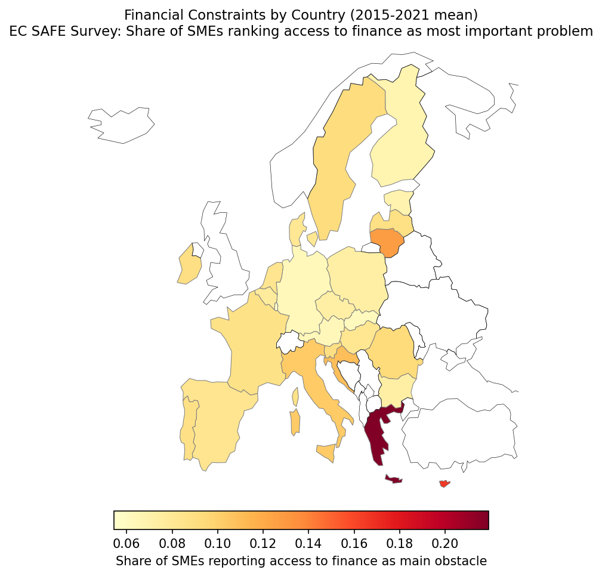
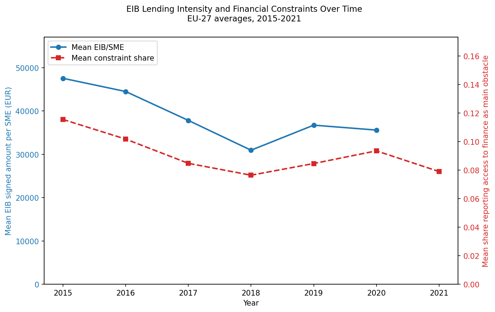
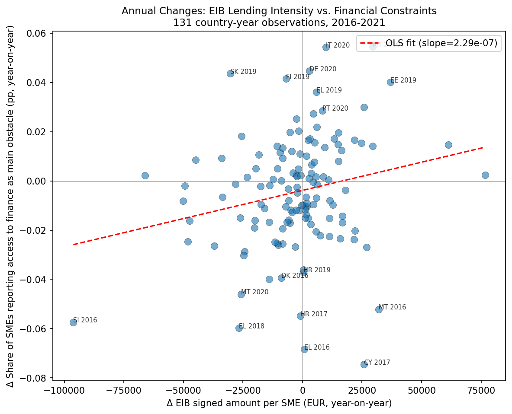

# EIB SME Lending and Financing Constraints: Country-Level Evidence

## Abstract

EIB intermediated SME lending is premised on correcting financing market failures. Regions where SMEs face more severe financing obstacles should attract more EIB support, and that support should ease constraints. This project tests both claims using country-level panel data from the public EIB Projects dataset against pre-registered specifications. Targeting regressions ask whether EIB per-SME lending is systematically higher where constraints are most acute. A between-country estimator finds that countries with worse average constraints do receive more EIB lending on average, but within-country variation in constraints does not predict within-country variation in EIB intensity. The within-country null is robust to several checks and heterogeneity analyses. Employing a shift-share instrument, we ask whether exogenous variation in EIB sectoral exposure causally reduces those constraints but find the instrument to be weak at the country-level, and so we put little credence in these results. We caveat our findings by noting that because the EIB Projects data has no sub-national geographic codes, analysis is limited to 27 countries and hence statistical power low. Planned extensions outlined towards the end (working with EIB-internal regional data or EIBIS microdata) would resolve these limitations, and the needed analysis pipeline has already been set up and pre-registered. A further contribution is our use of Git's content-addressing as a lightweight but cryptographically verifiable pre-registration mechanism before data access. All primary specifications, expected coefficient signs, and the primary/secondary designation for every estimating equation, including analysis extensions, were committed at a fixed, publicly visible hash that cannot be altered retroactively.

## Results

> **Pre-registered design.** All results below were specified before data access.
> Pre-analysis plan: [`f0313ba8ae0a293c36e2efbb581512e5c69cfbcd`](https://github.com/ruschenpohler/eib-seclending/blob/f0313ba8ae0a293c36e2efbb581512e5c69cfbcd/prespec-plan.md)
> · [Commit timestamp](https://github.com/ruschenpohler/eib-seclending/commit/f0313ba8ae0a293c36e2efbb581512e5c69cfbcd)

### Constraint geography and macro co-movement

With regressions confined to 27 EU member state clusters, the raw patterns in the data carry extra weight as a face-validity check.


*Figure 1: Financing constraint severity by country, 2015–2021 mean (ECB SAFE). Constraint shares are highest in Southern and Eastern Europe and lowest in Northern and Western Europe.*

The geographic distribution of financing constraints aligns with textbook market-failure geography: Southern and Eastern Europe (Cyprus, Greece, Croatia, Bulgaria, Romania, Hungary, Portugal) report the highest shares of SMEs ranking access to finance as their main obstacle, while Northern and Western Europe (Denmark, Netherlands, Germany, Austria, Luxembourg, Sweden, Finland) report the lowest. This validates the constraint measure as a plausible indicator of financing-gap severity.


*Figure 2: Mean EIB lending intensity and financing constraint share, EU-27 averages 2015–2021. Both series, in parallel, decline through 2018 then spike in 2020.*

Time-series trends show two notable patterns. First, a parallel pre-COVID decline: both mean EIB intensity and mean constraint severity fell from 2015 to 2018, then partly recovered into 2019. The co-movement is consistent with both series responding to the same macroeconomic driver — falling interest rates and ECB quantitative easing reduced financing constraints while also compressing demand for intermediated EIB credit — rather than EIB responding specifically to constraint severity. This shared macro sensitivity is consistent with the null targeting result. Second, the 2020 co-movement (both EIB intensity and constraints spiked) illustrates the confounding role of COVID-19, which the fixed-effects specification absorbs only imperfectly. Country-level facets show the same patterns for selected member states.


*Figure 3: Year-on-year changes in EIB lending intensity versus financing constraints, 131 country-year observations 2016–2021. Weakly positive correlation with outliers mostly due to single-project small-country volatility and COVID.*

The year-on-year scatter of changes in EIB intensity versus changes in constraints shows a weak positive correlation (r = +0.215). Outliers are dominated by small-country volatility: Slovenia 2016 saw EIB per SME collapse by EUR 96,000 following an anomalously large 2015 commitment (likely a single project), while constraints fell independently. Italy 2020 and Germany 2020 show constraints spiking while EIB rose only modestly; the COVID credit crunch overwhelmed EIB's counter-cyclical role. The scatter cannot discriminate between targeting, growth confounds, and pandemic shocks; that is the purpose of the regression specification.

### Does EIB lending target regions with worse financing constraints?

All regressions operate on at most 160 country-year observations across 27 EU member state clusters. With so few clusters, cluster-robust standard errors are unreliable; wild cluster bootstrap (WCB: 999 reps, Rademacher weights) is used throughout.

The pre-registered contemporaneous specification tests whether EIB lending per SME co-varies with the severity of financing constraints within country-year cells, controlling for GDP per capita, country fixed effects, year fixed effects, and a COVID-19 indicator:

$$\log(E_{rt}) = \beta \cdot C_{rt} + \gamma \cdot \log(G_{rt}) + \delta_r + \theta_t + D_{2020} + \varepsilon_{rt}$$

where $E_{rt}$ is EIB volume per SME, $C_{rt}$ is the constraint share, $G_{rt}$ is GDP per capita, and $D_{2020}$ is a COVID-19 indicator.

| Timing | β | SE | 95% CI | p-value | WCB p | N |
|---|---|---|---|---|---|---|
| Contemporaneous (within-country) | +3.48 | 3.41 | [−3.2, +10.2] | 0.316 | 0.328 | 160 |
| Lagged (t−1, within-country) | −0.19 | 2.25 | [−4.6, +4.3] | 0.933 | 0.901 | 133 |
| Between (country means) | +6.13 | 2.34 | [+1.5, +10.7] | 0.009 | — | 27 |

Both within-country point estimates are small relative to their standard errors and are not statistically distinguishable from zero. The 95% confidence interval for the contemporaneous specification spans from −3.2 to +10.2, and the interval for the lagged specification spans from −4.6 to +4.3. These intervals are wide; the data are consistent with both moderate positive targeting and moderate negative selection. Wild cluster bootstrap p-values (999 reps, Rademacher weights) confirm that neither estimate is significant at conventional levels: contemporaneous p = 0.328, lagged p = 0.901.

The between-country estimator tells a different story. Collapsing each country to its 2015–2021 mean and regressing mean log EIB intensity on mean constraint severity and mean log GDP per capita yields a positive and significant coefficient (+6.13, SE = 2.34, p = 0.009). Countries with worse average financing constraints do receive more EIB lending per SME on average. This cross-sectional targeting pattern is precisely what country fixed effects absorb in the within-country specification. The contrast suggests that EIB lending is structurally allocated toward countries with worse financing conditions, but does not respond to time-varying changes in those conditions within countries. In other words, EIB targets the right countries, but does not appear to vary its intensity counter-cyclically within them.

Given the standard error of 3.41 in the contemporaneous within-country specification, the minimum detectable effect at 80% power and 5% significance is approximately 9.6 percentage points of constraint share per log point of EIB lending per SME. In substantive terms, the within-country data can rule out targeting effects larger than this magnitude, but cannot rule out smaller effects. The estimates are therefore uninformative about whether modest within-country targeting exists.

#### Heterogeneity across market integration and constraint severity

Two additional splits test whether the null masks heterogeneity across financially integrated versus less integrated markets, or across high versus low constraint severity.

| Split | Sample | β | SE | 95% CI | p-value | N | Interpretation |
|---|---|---|---|---|---|---|---|
| Euro area | 19 countries | +2.58 | 4.15 | [−5.7, +10.9] | 0.543 | 112 | Not distinguishable from zero |
| Non-euro | 8 countries | +7.73 | 4.83 | [−3.0, +18.5] | 0.153 | 48 | Directionally larger, not significant |
| Interaction | Pooled | +6.74 | 5.38 | [−3.8, +17.3] | 0.221 | 160 | Euro vs. non-euro slope difference |
| High constraint | 14 countries | +4.00 | 3.07 | [−2.2, +10.2] | 0.215 | 83 | Not distinguishable from zero |
| Low constraint | 13 countries | +5.96 | 8.77 | [−11.8, +23.7] | 0.510 | 77 | Noisier, not distinguishable from zero |
| Interaction | Pooled | −2.12 | 7.90 | [−17.6, +13.4] | 0.791 | 160 | High vs. low slope difference |

*Note on interaction terms:* The interaction models are estimated on the full pooled sample with country and year fixed effects, imposing a common GDP coefficient and COVID effect across subgroups. The subsample regressions are estimated on restricted samples with their own fixed effects. Because the pooled and subsample regressions use different residual variation, the interaction coefficient does not mechanically equal the difference in subsample slopes. The interaction should be interpreted as a test of whether the pooled slope differs by subgroup, not as a decomposition of the subsample estimates.

The non-euro subsample coefficient is larger (+7.73 versus +2.58 in the euro area) and approaches significance (p = 0.15), consistent with the hypothesis that EIB has a stronger targeting rationale where financial markets are less integrated. However, the interaction term is not significant (p = 0.22), and with only 8 non-euro countries the estimate is noisy. The constraint-level split shows no meaningful difference; high-constraint and low-constraint countries both yield estimates that are not distinguishable from zero. Overall, the uninformative targeting result is robust to all six tested robustness and heterogeneity checks.

Overall, there is no evidence that EIB lending per SME is higher where financing constraints are worse at the country level. Several robustness checks and heterogeneity analyses suggest this may be a genuine finding, not merely a measurement artifact. However, there are a number of alternative explanations this analysis cannot distinguish, including:

1. Targeting occurs within countries (regional, sectoral, or project-level) and is washed out in aggregate.
2. EIB's mandate prioritises other dimensions (green investment, infrastructure, innovation) over financing-gap severity.
3. The country-level constraint measure is too coarse to detect targeting that responds to within-country variation.
4. With only 27 clusters, limited statistical power cannot be excluded as a partial explanation; the NUTS-2 extension would directly address this.

Pre-registered tests on downstream SME outcomes (industry investment rate and firm entry rate) yielded uninformative estimates, reported in [`outputs/tables/appendix_outcomes.md`](outputs/tables/appendix_outcomes.md). These regressions suffer from denominator mismatches (industry investment covers all firm sizes; firm entry uses the >=10 employees size class) and a short panel, and do not provide credible evidence on whether EIB lending affects SME outcomes.

### Can we exploit exogeneity in shifts to identify aggregate causal effects?

The targeting regressions show no within-country-year association between EIB intensity and constraint severity. But OLS is uninformative on the causal question of whether EIB lending reduces financing constraints because reverse causality and common macroeconomic shocks both confound the estimate. We therefore turn to a shift-share instrument, following Borusyak, Hull, and Jaravel (2022). We posit that EU-aggregate EIB commitments are set by EIB-board portfolio decisions *at the level of a sector* (i.e., energy transition, infrastructure, innovation priorities) and *across the EU as a whole* and are hence plausibly exogenous to any individual country's financing conditions. Countries inherit differential EIB exposure depending on whether their pre-existing industrial structure happened to be concentrated in sectors that subsequently received large EU-level commitments.

#### Construction

The shift-share instrument is constructed exactly as pre-registered:

$$B_{rt} = \sum_j s_{jr,2015} \cdot L_{jt}$$

where $s_{jr,2015}$ is the employment share of country $r$ in sector $j$ (base year 2015) and $L_{jt}$ is EU-aggregate EIB lending in sector $j$ at time $t$.

Employment shares are from Eurostat SBS V16110 (persons employed), size classes 10–249 aggregated, base year 2015. EIB sectoral shifts are EU-aggregate signed amounts by NACE section and year from the EIB Projects Financed CSV, mapped via a manual crosswalk (`data/raw/eib_nace_crosswalk.csv`). Eleven NACE sections are common to both datasets (C, D, E, F, G, H, I, J, L, M, N).

#### First stage

$$\log(E_{rt}) = \pi \cdot B_{rt} + \gamma \cdot \log(G_{rt}) + \delta_r + \theta_t + D_{2020} + u_{rt}$$

| Coefficient | Estimate | SE | t | p | F-statistic |
|---|---|---|---|---|---|
| Shift-share | 1.72×10⁻⁹ | 1.10×10⁻⁹ | 1.56 | 0.130 | **2.45** |

#### The instrument is too weak at the country level to support a causal claim

The first-stage Kleibergen-Paap F-statistic is 2.45, far below the conventional threshold of 10. But the weakness runs deeper than the F-statistic. Following Borusyak, Hull, and Jaravel (2022), the effective number of independent shocks driving identification is the inverse Herfindahl of the average employment share concentration across sectors. With 12 NACE sections in the instrument, the inverse Herfindahl is only 6.1. Identification is therefore driven by the equivalent of roughly six independent sectoral shocks, not twelve. This low effective shock count, combined with only 27 geographic units, means the instrument lacks the variation needed for credible causal inference even before the first-stage regression is run. The public EIB Projects dataset contains no NUTS-2 codes, so regional-level analysis is not feasible with public data alone. Per the pre-registered protocol, the 2SLS second stage is not reported as causal. The instrument and code are documented and saved for use once regional-level data become available.

---

## Extensions and next steps

The null targeting result and the weak shift-share instrument share a common root: the public EIB dataset resolves only to the country level. Both limitations would be substantially addressed with either EIB-internal regional data or EIBIS microdata. The specific extensions below represent a natural continuation of this work.

#### EIB-internal data with NUTS-2 granularity

EIB-internal data contain NUTS-2 or NUTS-3 region codes for each project, enabling analysis across roughly 200 regions rather than 27 countries. With that variation, the shift-share first stage could plausibly clear the F > 10 threshold. NUTS-2 employment shares and project-level intermediated-operation flags would also align the numerator (EIB volume) with the SME denominator more precisely. Regional-level targeting regressions would provide an answer to the most substantively important open question from the current analysis: whether the null country-level result masks within-country variation.

#### EIBIS microdata for firm-level causal inference

The pre-registered primary causal test is the Callaway-Sant'Anna staggered difference-in-differences on EIBIS firm-level panel data. EIBIS contains roughly 12,000 firms across EU-27 with survey waves 2016–2025, including indicators for EIB-supported financing, green investment share, and firm characteristics (e.g., size, sector, export status). To our knowledge, this would be the first pre-registered, staggered-adoption DiD test of EIB green investment additionality.

#### Bayesian hierarchical models with partial pooling

A known limitation of country-level analysis is that small countries (e.g., Luxembourg, Malta, Slovenia) have extreme per-SME volatility driven by one or two projects. A Bayesian hierarchical model with partial pooling would shrink small-country estimates toward the EU mean in proportion to their uncertainty, producing more reliable descriptive rankings and potentially tightening targeting regression estimates by borrowing strength across countries (see Gelman and Hill, 2007). An implementation of such heterogeneity analysis as applied to the context of customer churn can be found in the Bayesian Segmentation project.

#### Sectoral green-investment shift shares

An alternative shift-share instrument would use EU-level green investment growth by sector (from Eurostat or the IEA) as the shifter, rather than EIB sectoral lending volumes. This would test whether regions with industrial structures tilted toward fast-growing green sectors receive more EIB support. Because green sector growth likely affects firm-level green investment directly (through industrial composition), this may be more of a descriptive exercise rather than a causal instrument. But it would be informative about EIB's thematic alignment with the green transition.

---

## Contribution relative to existing literature

Amamou, Gereben, and Wolski (2020) use propensity-score matching with difference-in-differences and find positive employment and investment effects of EIB intermediated lending, but cannot address staggered adoption or test the green investment mechanism. Barbera, Gereben, and Wolski (2022) estimate heterogeneous treatment effects using a generalized propensity score for continuous treatment intensity, again finding positive employment and investment effects, but rely on the same matching identification strategy. This project contributes in three respects:

1. A pre-registered design (including a credible signal that it cannot be adjusted post-hoc without a formal extension)
2. A transparent diagnosis of why country-level public data cannot resolve targeting or causal identification
3. A ready-to-execute pipeline for Callaway and Sant'Anna (2021) staggered difference-in-differences estimators (that, with EIBIS data, would yield the first pre-registered credibly causal estimate of EIB investment additionality)

---

## Repository structure

```
eib-seclending/
├── src/
│   ├── ingest/          # one file per data source
│   ├── analysis/        # one file per analysis step
│   └── viz/             # figure generation
├── outputs/
│   ├── figures/         # versioned deliverables
│   └── tables/          # versioned deliverables
├── data/                # gitignored (raw, interim, processed)
├── notebooks/           # exploratory only
├── prespec-plan.md      # pre-registered specifications (write-once)
└── README.md            # this file
```

## Environment

Managed with `uv`. Reproduce with:

```bash
uv sync
uv run python src/analysis/<script>.py
```

---

## References

Amamou, R., Gereben, Á., & Wolski, M. (2020). Making a difference: Assessing the impact of the EIB's funding to SMEs. *EIB Working Paper 2020/04*, European Investment Bank.

Barbera, A., Gereben, Á., & Wolski, M. (2022). Estimating conditional treatment effects of EIB lending to SMEs in Europe. *EIB Working Paper 2022/03*, European Investment Bank. Also published as *BIS Working Papers* 1006.

Borusyak, K., Hull, P., & Jaravel, X. (2022). Quasi-experimental shift-share research designs. *The Review of Economic Studies*, 89(1), 181–213.

Callaway, B., & Sant'Anna, P. H. C. (2021). Difference-in-differences with multiple time periods. *Journal of Econometrics*, 225(2), 200–230.

Gelman, A., & Hill, J. (2007). *Data Analysis Using Regression and Multilevel/Hierarchical Models*. Cambridge University Press.
